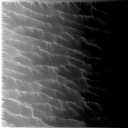
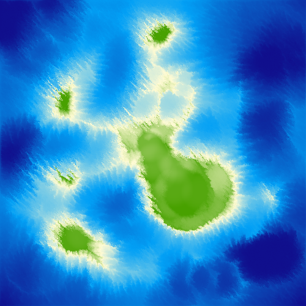

# Erosion Sim

A simulation inspired by erosion. Created using Processing 3.

## Results (WIP)




## Running
Execute ErosionSim.pde with `processing-java`.

On linux this is:   
```processing-java --force '--sketch=./' '--output=./out' --run```

### Controls
- GUI

## TODO
- Change GUI labels to be easier to interpret
    - Does G4P support tooltips?
    - Update window title
    - Update readme with full feature explanation
- Add erosion settings presets
- Show preview of display gradient
- Show water sources while editing
- Initialize simulation with some water sources
    - Add button to cover entire area with rain
    - Pack these into the channels of the heightmap files
- Begin with the simulation in an understandable state
- Test mouse brush on trackpad
- Remove GUI debug prints
- Add gray color scheme for disabled buttons

# Stretch goals
- Add gradient editor
- Fix directional bias on flat ground
- Implement terrain resistance map to mimic different materials
- Remember settings window position
- Add grouping and movement to rain pattern