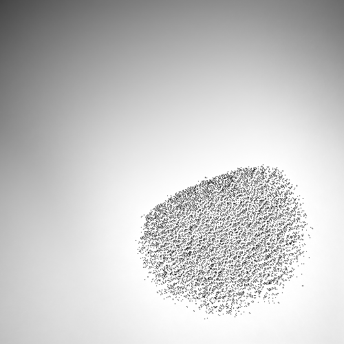
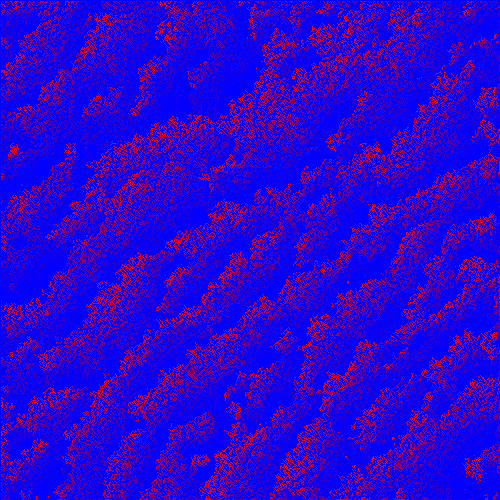

# Erosion Sim

A simulation inspired by erosion. Created using Processing 3.

## Results (WIP)



## Running
Execute ErosionSim.pde with `processing-java`.

On linux this is:   
```processing-java --force '--sketch=./' '--output=./out' --run```

### Controls
**n** - Do one simulation step  
**c** - Continue running simulation steps (toggle)  
**r** - Create 1000 additional raindrops    
**p** - Toggle console status messages  
**d** - Toggle display of water droplets over terrain   
**s** - Save the current terrain to `./Outputs`

## TODO
- Implement terrain resistance map to mimic different materials
- Move settings to config file
- Add a parameter for the number of cycles to run the simulation for
- Add a parameter for the amount of upward slope that droplets can traverse
    - Hopefully will help to keep them from getting stuck
- Add displaying results with a gradient of multiple colors
- Add grouping and movement to rain pattern
    - Can I generate a voronoi texture?
- Make speed dependent on the slope droplets travel
    - Speed will affect the amount of sediment they deposit and leave
    - Also use impact speed to determine rainsplash erosion
- Finish or remove gradient filter implementation
    - The intention was to compute the whole image gradient at once, rather than compute the downhill each droplet's neighbors iteratively. But unless droplet density sufficiently increases, it may be faster going by droplet so that no computation is needed for unpopulated image areas.