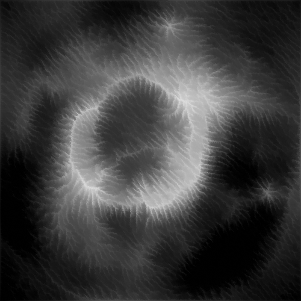
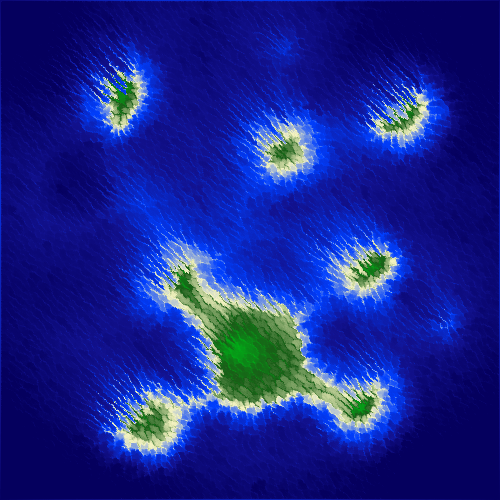
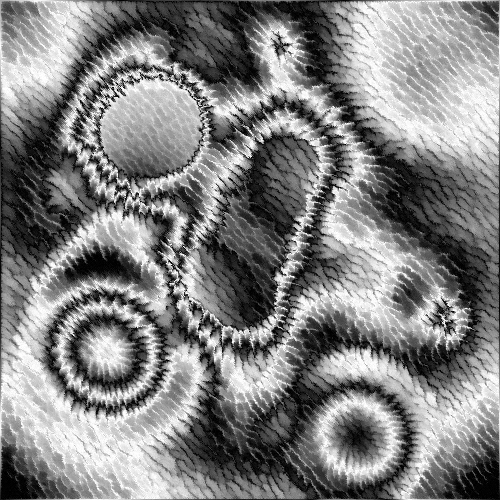
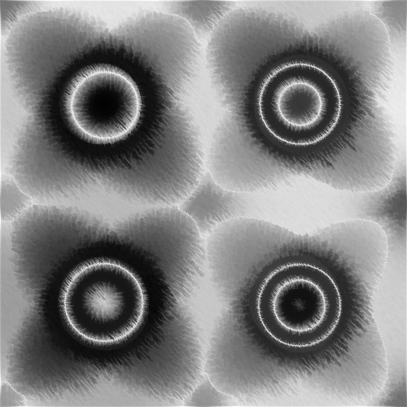
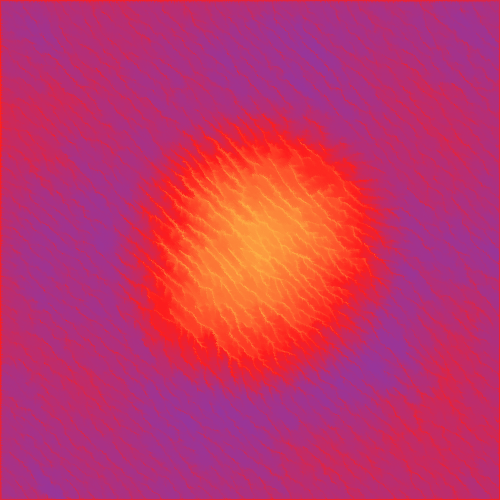

# Erosion Sim

A simulation inspired by hydraulic erosion, where water droplets representing rain redistribute sediment over the image. Created using Processing 3.

## Results
| | |
:-:|:-:
 | 
 | 
 | 
 | 


## Running
### From a package
Navigate to the [releases](https://github.com/maxlep/ErosionSim/releases) page of this repository and download the executable for your operating system.

### From source
Execute ErosionSim.pde with `processing-java`.

On linux this is:   
```processing-java --force '--sketch=./' '--output=./out' --run```


## Controls

### Diplay Settings

- **Load map:** Open a file browser window to select a heightmap to load. The green channel of the selected image will be used as the height value, and the blue channel will be used to determine where rain may be added.
- **Reload:** Reload the last heightmap.
- **Save heightmap:** Saves the current heightmap and rain configuration to a single image to reload later; height is stored in the green channel and the rain map is stored in the blue channel.
- **Display gradient:** Choose from several gradients to display the values on the heightmap. The Grayscale setting shows the raw heightmap values.
- **Scaling:** Set the amount of upscaling for the simulation display. Note that values greater than 1 significantly impact simulation speed.
- **Show droplets:** Toggles the display of water droplets over the heightmap.

### Erosion controls

- **Play/Pause:** Play or pause the simulation.
- **Step:** Run a single step of the simulation.
- **Erosion presets:** Select from several presets for the erosion parameters in this panel.
- **Reload preset:** Reset the erosion settings to the currently selected preset.
- **Droplet count:** The maximum number of droplets processed in the simulation at once.
- **Max droplet lifetime:** The maximum number of steps a single droplet may exist for.
- **Initial speed:** The initial speed of newly added droplets.
- **Inertia:** The amount of velocity the droplets will retain each step. Low values will make the droplets more subject to the slope of the terrain, while high values will preserve their speed and direction more.
- **Droplet volume:** The volume of water that each droplet starts with. This affects the amount of sediment they may carry.
- **Evaporate speed:** The speed at which water evaporates from the droplets, decreasing their carrying capacity and erosion capability.
- **Erode strength:** Multiplier for the amount of erosion each droplet will cause each step.
- **Deposit strength:** Multiplier for the amount of sediment droplets will deposit each step.

### Mouse tools

- **Terrain:** Selects the terrain brush for editing the heightmap.
- **Water source:** Selects the water brush for editing where rain occurs.
- **Left click** in the simulation window with either brush to draw/add.
- **Right click** in the simulation window with either brush to erase/subtract.
- **Scroll** in the simulation window to adjust the size of the current brush.
- **Brush radius:** The size of the current brush
- **Brush hardness:** The hardness of the current brush. Low values will make the brush strength falloff quickly from the center, while high values will have more even strength over the brush area.

### Debug Info

- **Steps:** How many steps have been processed in the current simulation. This is reset when the map is reloaded.
- **Steps/sec:** The current rate at which the simulation is running.
- **Droplets:** The number of droplets currently active in the simulation.
- **Mouse:** The coordinate of the map location that the mouse is above.
- **Height:** The height of the map location that the mouse is above.
- **Gradient:** The slope of the map location that the mouse is above.

## TODO
- Add gradient editor
- Fix directional bias on flat ground
- Implement terrain resistance map to mimic different materials
- Remember settings window position
- Add grouping and movement to rain pattern
- Test mouse brush on trackpad